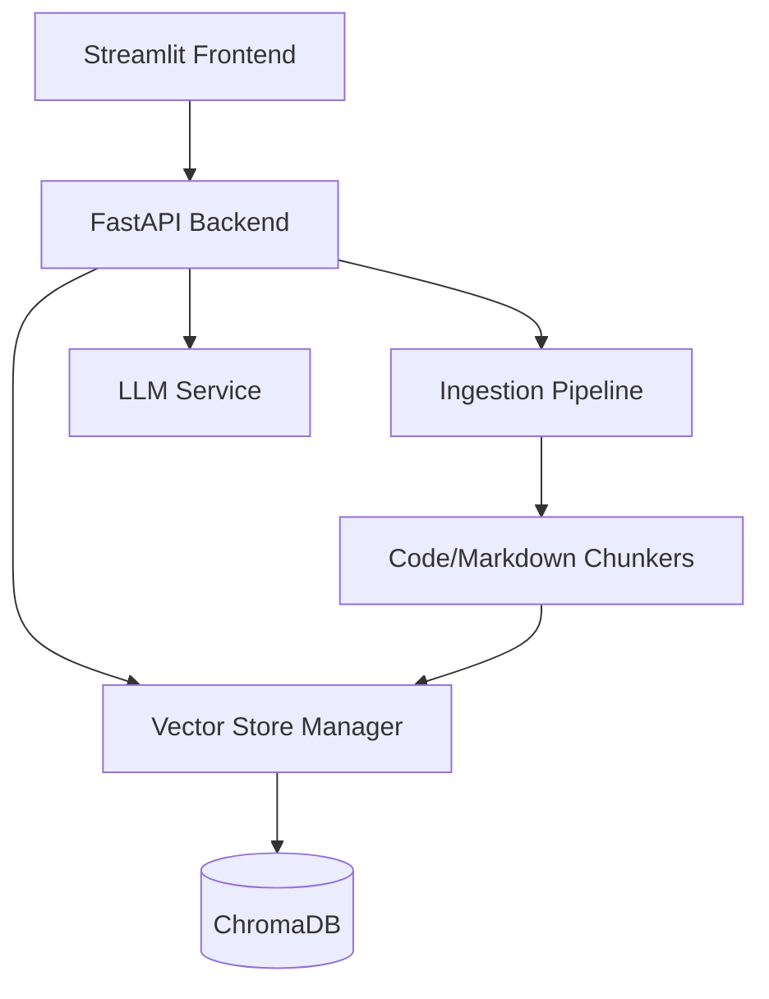

# 🤖 Agentic RAG Chat

A high-performance, modular Retrieval-Augmented Generation (RAG) system built with **FastAPI**, **Streamlit**, and **ChromaDB**. This project implements a full pipeline for document ingestion, semantic chunking, and intelligent querying.

[](https://www.python.org/)
[](https://fastapi.tiangolo.com/)
[](https://streamlit.io/)

---

## 🌟 Features

- **End-to-End Pipeline**: From file upload to LLM-powered response generation.
- **Smart Chunking**: Specialized ingestion for Markdown, Python, and other code types.
- **Vector Search**: Integrated `VectorStoreManager` for efficient similarity lookups using ChromaDB.
- **Interactive UI**: A sleek Streamlit-based frontend for real-time chatting with your documents.
- **RESTful API**: Robust FastAPI backend for programmatic access.

---

## 🏗️ Project Architecture



---

## 🚀 Getting Started

### Prerequisites

- [uv](https://github.com/astral-sh/uv) - An extremely fast Python package manager.
- Python 3.13+

### Installation

1. **Clone the repository**:
   ```bash
   git clone <repository-url>
   cd agentic-rag-chat
   ```

2. **Set up the environment**:
   ```bash
   # Create venv and install dependencies automatically
   uv sync
   ```

3. **Configure environment variables**:
   Create a `.env` file in the root directory (refer to `.env.example` if available).
   ```bash
   touch .env
   # Add your API keys and configuration
   ```

---

## 🏃 Running the Application

### 1. Start the Backend API
From the project root, run:
```bash
uv run uvicorn app.main:app --host 0.0.0.0 --port 8000
```

### 2. Start the Streamlit Frontend
In a new terminal:
```bash
uv run streamlit run app/frontend.py
```

---

## 🛠️ Ingestion & Querying

- **Upload Documents**: Use the UI or POST to `/upload` to index new files.
- **Query**: Ask questions via the frontend or use the `/query` endpoint.

---

